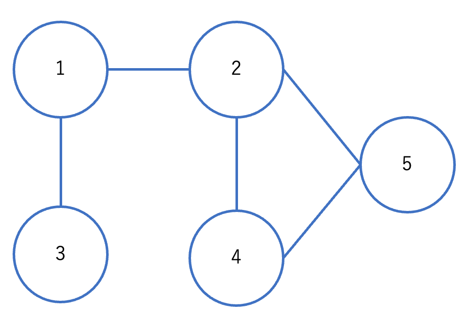
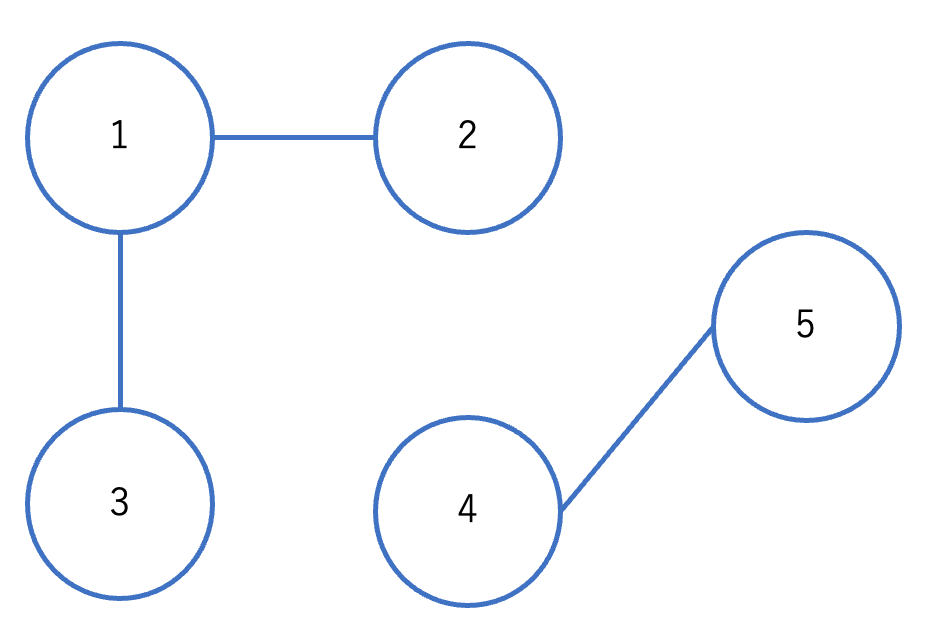
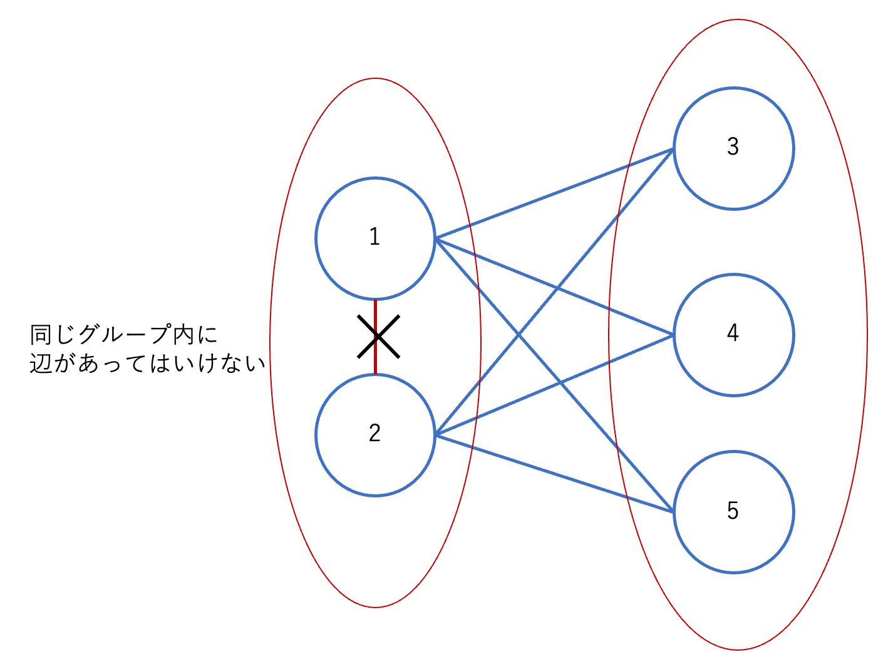
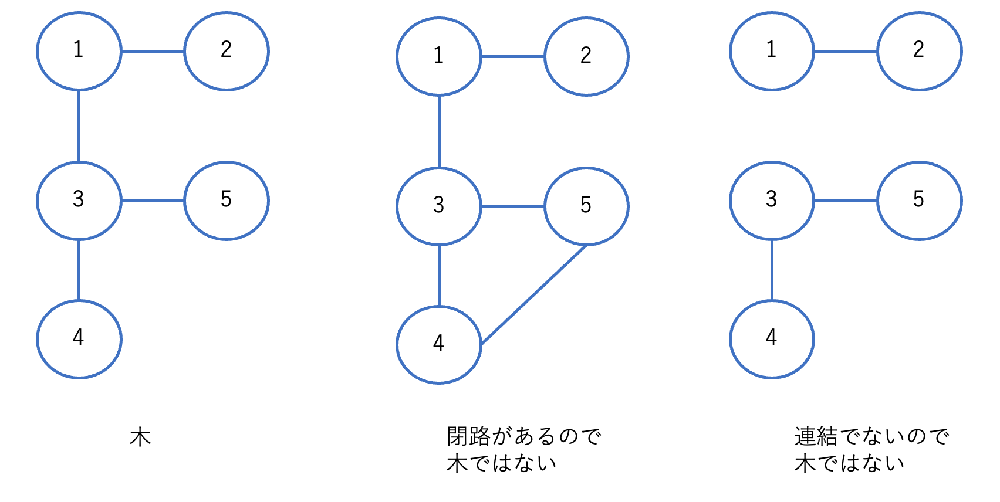
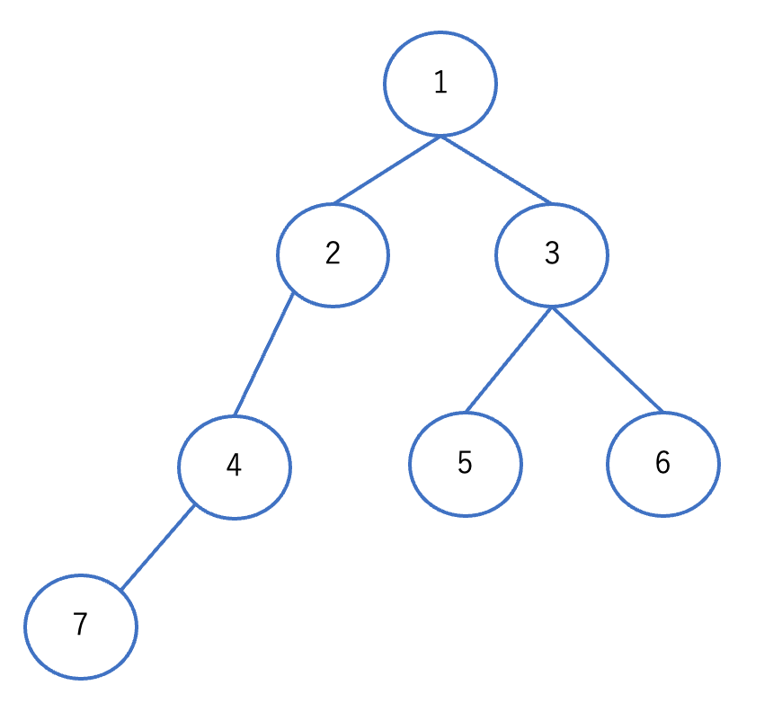
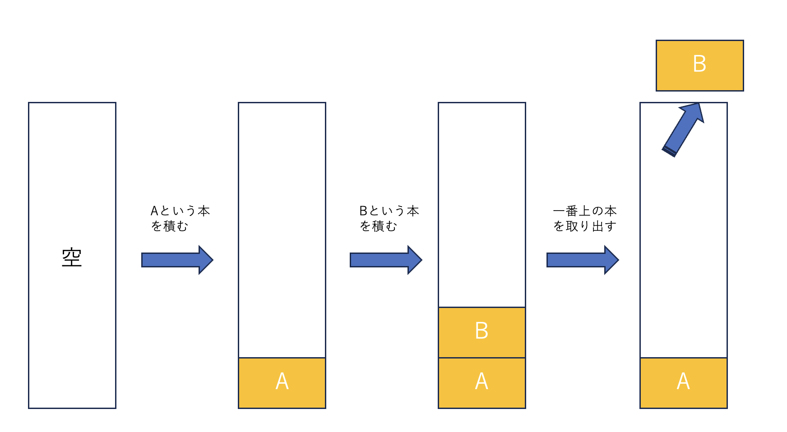
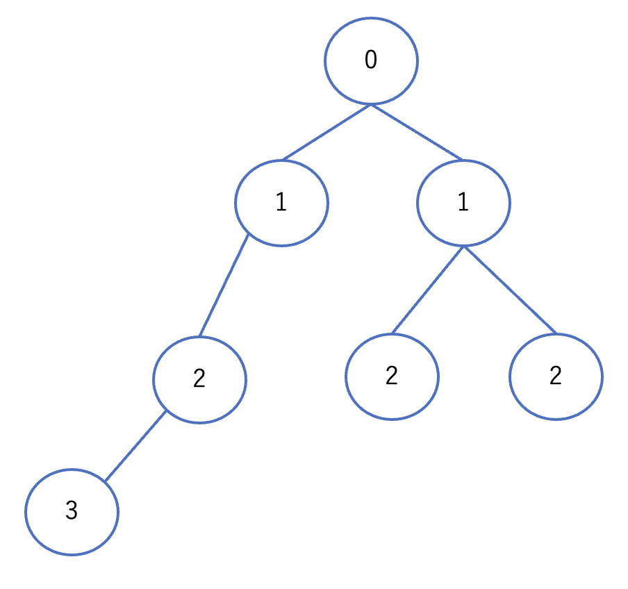

# グラフアルゴリズム

## グラフとは

グラフとは、以下の図のように、頂点とそれを結ぶ辺からなる構造のことを言います。



図 1: グラフの例

### グラフの例

グラフってなんの役に立つの？と思うかもしれませんが、実はグラフは私たちの身の回りにたくさん存在しています。

- 友達関係

友達関係や家族関係、SNS のフォロー関係などは、人を頂点、人と人の関係を辺として、グラフで表すことができます。

- 道路網

道路網は、交差点を頂点、道路を辺として、グラフで表すことができます。

- ネットワーク

ネットワークは、コンピュータを頂点、コンピュータ間の通信を辺として、グラフで表すことができます。

## グラフの用語

グラフの用語の性質について説明します。

### 有向グラフ・無向グラフ

グラフには、有向グラフと無向グラフの 2 種類があります。
有向グラフは辺に方向があるグラフで、SNS のフォロー関係などはフォローしている人からフォローされている人への辺に向きを持たせることができます。

無向グラフは辺に方向がないグラフで、SNS の相互フォロー関係などで向きがない辺になります。

### 重み付きグラフ・重みなしグラフ

重み付きグラフは、辺に重みがあるグラフで、道路網などは道路の長さを重みとして持つことができます。

### 次数

頂点につながっている辺の数を次数と言います。

上の画像でいうと、頂点 1 の次数は 2、頂点 3 の次数は 1 となります。

### 隣接・連結

頂点 A と頂点 B が辺でつながっているとき、頂点 A と頂点 B は隣接していると言います。

また、どの頂点間も隣接している頂点を辿ることで到達可能である時、グラフは連結であると言います。

図 1 のグラフは連結であると言えますが、以下のグラフは連結ではありません。



図 2: 連結でないグラフ

### 閉路

頂点 A から辿って頂点 A に戻ってくることができるとき、頂点 A を始点とする閉路が存在すると言います。

図 1 のグラフでは、4->5->2->4 という閉路が存在します。

### パス

頂点 A から辿って頂点 B に到達できるとき、頂点 A から頂点 B へのパスが存在すると言います。特に、同じ辺を 2 度以上通らないパスを単純パスと言います。

### 二部グラフ

頂点を 2 つのグループに分けて、同じグループの頂点同士は辺でつながっていないグラフを二部グラフと言います。



図 3: 二部グラフ

### 木

閉路を持たず、連結なグラフを木と言います。任意の木は、頂点数が $N$ のとき、辺の数が $N-1$ であることが知られています。
(暇な人は証明してみて下さい。数学的帰納法を使うとよいでしょう。)



図 4: 木

また、木はある頂点を根として根付き木として表すことができます。この時、根以外で次数が 1 の頂点を葉と言います。

根付き木において、一つ上の頂点を親、一つ下の頂点を子と言います。

下の例は、頂点 1 を根とする根付き木を表しています。たとえば、頂点 4 の親は頂点 2、頂点 3 の子は頂点 5 と頂点 6 です。葉は頂点 5、頂点 6、頂点 7 です。

ある頂点から根までの長さ(たどった辺の数)を深さと言います。たとえば、頂点 4 の深さは 2 です。



図 5: 根付き木

## Union-Find

Union-Find は、グラフの連結成分を管理するデータ構造です。
木をイメージするのに適しているのでこの段階で紹介します。

以下の動画がわかりやすいので、まずは見てみて下さい。

- [【木マスター養成講座】3-1. UnionFind 木ってなに〜？説明編【競プロかつっぱ】](https://www.youtube.com/watch?v=nclfErc9pbE)
- [【木マスター養成講座】3-2. UnionFind 木ってなに〜？2 つのひと工夫編【競プロかつっぱ】](https://www.youtube.com/watch?v=8AJy3Ewx7AY)

### 練習

1. [AtCoder Beginner Contest 075 C - Bridge](https://atcoder.jp/contests/abc075/tasks/abc075_c)
2. [AtCoder Beginner Contest 120 D - Decayed Bridges](https://atcoder.jp/contests/abc120/tasks/abc120_d)

2 は難しいので、1 時間考えてわからなかったら解説を見て下さい。

### 解答例

python での実装例を示します。他の言語では以下のリンクを参照して下さい。

<details>
<summary>pythonの解答例</summary>

1. [ABC075 C - Bridge](https://atcoder.jp/contests/abc075/submissions/22574891)

まず普通に union-find 木を構築します。union-find 木の構築には、[atcoder のライブラリ](https://github.com/not522/ac-library-python)を使うと便利です。

その後、各辺がない場合の union-find 木を構築します。元々構築した union-find 木のグループ数よりも、各辺がない場合の union-find 木のグループ数より増えた場合、その辺は橋であると言えます。

```python
from atcoder.dsu import DSU

N, M = map(int, input().split())

dsu = DSU(N+1)

A, B = [], []

for _ in range(M):
    a, b = map(int, input().split())
    A.append(a)
    B.append(b)
    dsu.merge(a, b)

groups = dsu.groups()

count = 0
for a, b in zip(A, B):
    check_uf = DSU(N+1)
    for aa, bb in zip(A, B):
        if aa == a and bb == b:
            continue
        else:
            check_uf.merge(aa, bb)
    if len(check_uf.groups()) > len(groups):
        count += 1

print(count)
```

2. [ABC120 D - Decayed Bridges](https://atcoder.jp/contests/abc120/submissions/22574901)

[【Python3】 AtCoder Beginner Contest 120 D – Decayed Bridges](https://blog.satoooh.com/entry/6464/)が参考になります。

```python
from atcoder.dsu import DSU

N, M = map(int, input().split())

dsu = DSU(N)

A, B = [], []

for _ in range(M):
    a, b = map(int, input().split())
    A.append(a-1)
    B.append(b-1)

# 答えを格納する配列
# 最初はすべて繋がっていないのでNから2つ選ぶ組み合わせを入れる
ans = [-1] * M
ans[-1] = int(N * (N - 1) * 0.5)

for i in range(M-1, 0, -1):
    # 同じグループなら変化しない
    if dsu.same(A[i], B[i]):
        ans[i - 1] = ans[i]
    else:
        # 橋をつけることでグループの島それぞれに対して行き来可能になる
        # 例えば、2つのグループと3つのグループがくっつくと、6だけ不便さが減る
        ans[i - 1] = ans[i] - dsu.size(A[i]) * dsu.size(B[i])
    dsu.merge(A[i], B[i])

for x in ans:
    print(x)
```

</details>

| 問題番号 | Python                               | Rust                               | Go                               | C++                                 | Kotlin                               |
| -------- | ------------------------------------ | ---------------------------------- | -------------------------------- | ----------------------------------- | ------------------------------------ |
| 1        | [.py](./python/1.bridge.py)          | [.rs](./rust/1.bridge.rs)          | [.go](./go/1.bridge.go)          | [.cpp](./cpp/1.bridge.cpp)          | [.kt](./kotlin/1.bridge.kt)          |
| 2        | [.py](./python/2.decayed_bridges.py) | [.rs](./rust/2.decayed_bridges.rs) | [.go](./go/2.decayed_bridges.go) | [.cpp](./cpp/2.decayed_bridges.cpp) | [.kt](./kotlin/2.decayed_bridges.kt) |

## グラフの実装

以下の問題を考えてみましょう。

- [競技プログラミングの鉄則　演習問題集 A61-Adjacent Vertices](https://atcoder.jp/contests/tessoku-book/tasks/tessoku_book_bi)

この問題は、 $N$ 個の頂点と $M$ 個の辺からなるグラフが与えられるので、各頂点の隣接した要素を出力する問題です。

例えば図 1 のグラフの場合、頂点 4 の隣接した頂点は頂点 2 と頂点 5 です。
これを各頂点について出力します。

### 隣接リスト

グラフをプログラムで扱う場合、隣接リストと隣接行列の 2 種類の方法があります。この資料では隣接リストについて説明します。(これを知っていれば当分は十分です。興味がある人は隣接行列についても調べてみて下さい。)

隣接リストは、各頂点について、隣接する頂点をリストで持つ方法です。

プログラム上で配列 $G$ を用意し、 $G[i]$ には頂点 $i$ に隣接する頂点の配列を持ちます。

例えば図 1 を隣接リストで表した場合、 $G[4]$ にアクセスすると、 $G[4] = [2, 5]$ となります。なぜなら、頂点 4 に隣接する頂点は頂点 2 と頂点 5 だからです。

### 実装

隣接リストを用いて、上の問題を解いてみましょう。

### 解答例

python での実装例を示します。他の言語では以下のリンクを参照して下さい。

<details>
<summary>pythonの解答例</summary>

```python
N, M = map(int, input().split())

G = {} # 隣接リストを表す辞書
for i in range(1, N+1):
    G[i] = set() # 頂点iに隣接する頂点の集合

for i in range(1, M+1):
    A, B = map(int, input().split())

	# 無向グラフなので、両方向に辺を張る
    G[A].add(B)
    G[B].add(A)


for key in G.keys():
	# 頂点keyに隣接する頂点がない場合は、空集合を出力
    if len(G[key]) == 0:
        print(f"{key}:", "{}")
    else:
        print(f"{key}:", G[key])
```

</details>

| 問題番号 | Python                                 | Rust                                 | Go                                 | C++                                   | Kotlin                                 |
| -------- | -------------------------------------- | ------------------------------------ | ---------------------------------- | ------------------------------------- | -------------------------------------- |
| 3        | [.py](./python/3.adjacent_vertices.py) | [.rs](./rust/3.adjacent_vertices.rs) | [.go](./go/3.adjacent_vertices.go) | [.cpp](./cpp/3.adjacent_vertices.cpp) | [.kt](./kotlin/3.adjacent_vertices.kt) |

## グラフの探索

グラフを探索するには、幅優先探索と深さ優先探索の 2 種類の方法があります。ここではまず、これらを実装するのに必要なデータ構造である「スタック」と「キュー」について説明します。

### スタック

スタックは、先入れ後出しのデータ構造です。具体例で考えたほうがわかりやすいので、以下の問題を考えてみましょう。

- [競技プログラミングの鉄則　演習問題集 A51-Stack](https://atcoder.jp/contests/tessoku-book/tasks/tessoku_book_ay)

図解してみましょう。

まずからの箱があり、Aを入れ、次に B を入れます。そして一番上を取り出すと、B が取り出されます。

これは、先に入れたものが後に取り出されているので、先入れ後出しと言えます。先入れ後出しのデータ構造をスタックと言います。



実装してみましょう。

pythonでは、リストをスタックとして使うことができます。リストの append メソッドで要素を追加し、pop メソッドで要素を取り出すことができます。また、いちばん上の要素を取り出すだけなら、リストのインデックス -1 でアクセスすることもできます。

<details>
<summary>pythonの解答例</summary>

```python
Q = int(input())

stack = []
for _ in range(Q):
    line = input()
    query = line[0]
    if query == "1":
        book = line.split()[1]
        stack.append(book)
    elif query == "2":
        print(stack[-1])
    else:
        stack.pop()
```

</details>

| 問題番号 | Python                           | Rust                           | Go                           | C++                             | Kotlin                           |
| -------- | -------------------------------- | ------------------------------ | ---------------------------- | ------------------------------- | -------------------------------- |
| 4        | [.py](./python/4.stack.py)       | [.rs](./rust/4.stack.rs)       | [.go](./go/4.stack.go)       | [.cpp](./cpp/4.stack.cpp)       | [.kt](./kotlin/4.stack.kt)       |

### 練習問題

#### 5

`({}){()(())}`のような、`(`と`)`、`{`と`}`からなる文字列が与えられるので、この文字列が正しい括弧列であるかどうかを判定して下さい。

例えば、`({})`は正しい括弧列ですが、`({)}`は正しくありません。

スタックを使って簡単に実装することができます。

ここではpythonの解答例を示します。他の言語では以下のリンクを参照して下さい。

<details>
<summary>pythonの解答例</summary>

```python
S = input()

stack = []
ok = True
for s in S:
    if s == '(' or s == '{':
        stack.append(s)
    else:
        if len(stack) == 0:
            ok = False
            break

        l = stack.pop()
        if s == ')' and l != '(':
            ok = False
            break

        if s == '}' and l != '{':
            ok = False
            break

print(ok)
```

</details>

| 問題番号 | Python                           | Rust                           | Go                           | C++                             | Kotlin                           |
| -------- | -------------------------------- | ------------------------------ | ---------------------------- | ------------------------------- | -------------------------------- |
| 5        | [.py](./python/5.bracket.py)     | [.rs](./rust/5.bracket.rs)     | [.go](./go/5.bracket.go)     | [.cpp](./cpp/5.bracket.cpp)     | [.kt](./kotlin/5.bracket.kt)     |

### キュー

キューは、先入れ先出しのデータ構造です。具体例で考えてみましょう。

- [競技プログラミングの鉄則　演習問題集 A52-Queue](https://atcoder.jp/contests/tessoku-book/tasks/tessoku_book_az)

先ほどのスタックとは異なり、先に入れたものが先に取り出されているので、先入れ先出しと言えます。

pythonでは[deque](https://docs.python.org/ja/3/library/collections.html#collections.deque)を使うとキューを実装することができます。

- 最後尾に追加する: `append`
- 先頭から取り出す: `popleft`
- 先頭を見る: インデックス 0 でアクセスする

<details>
<summary>pythonの解答例</summary>

```python
from collections import deque
Q = int(input())

queue = deque()

for _ in range(Q):
    line = input()

    query = line[0]
    if query == '1':
        name = line.split()[1]
        queue.append(name)
    elif query == '2':
        print(queue[0])
    else:
        queue.popleft()
```

</details>

| 問題番号 | Python                           | Rust                           | Go                           | C++                             | Kotlin                           |
| -------- | -------------------------------- | ------------------------------ | ---------------------------- | ------------------------------- | -------------------------------- |
| 6        | [.py](./python/6.queue.py)       | [.rs](./rust/6.queue.rs)       | [.go](./go/6.queue.go)       | [.cpp](./cpp/6.queue.cpp)       | [.kt](./kotlin/6.queue.kt)       |

### 幅優先探索(BFS)

まずは幅優先探索について説明します。以下の問題を考えてみましょう。

- [競技プログラミングの鉄則　演習問題集 A63-Shortest Path 1](https://atcoder.jp/contests/tessoku-book/tasks/math_and_algorithm_an)

この問題は、グラフの頂点数 $N$、辺の数 $M$、頂点 $1$ から各頂点への最短距離を求める問題です。

解き方を解説します。まず頂点1からの最短距離を格納しておく配列を用意します。最初はすべての頂点の最短距離を-1にしておきます。また、頂点1は頂点1からの距離が0なので、最初から0にしておきます。

```python
ans = [-1] * N
ans[0] = 0
```

次に頂点1に隣接している頂点の要素を1にします。そして、次はその頂点に隣接している頂点の要素を2にします。これを繰り返していきます。



図 6: 幅優先探索

同じ高さにある要素が同じ値になっており、幅を意識している感じがしますよね。これが幅優先探索です。

またこれは、キューを使って、次のように言い表すことができます。

- キューに頂点1を入れる
- キューから頂点を取り出す
- 取り出した頂点に隣接している頂点をキューに入れ、その頂点の要素を取り出した頂点の要素+1にする
- キューが空になるまで繰り返す

キューに入れることで、先に入れたものから順番に取り出すことができ、隣接しているものを優先できるので、幅優先探索が実現できます。

以下の記事を見ると視覚的にわかりやすいです。

- [BFS (幅優先探索) 超入門！ 〜 キューを鮮やかに使いこなす 〜](https://qiita.com/drken/items/996d80bcae64649a6580)

ここまでの説明を踏まえて、実装してみましょう。

### 解答例

python での実装例を示します。他の言語では以下のリンクを参照して下さい。

<details>
<summary>pythonの解答例</summary>

```python
from collections import deque

N, M = map(int, input().split())

G = {} # 隣接リストを表す辞書
for i in range(N):
    G[i] = set() # 頂点iに隣接する頂点の集合

for i in range(M):
    A, B = map(int, input().split())

	# 無向グラフなので、両方向に辺を張る
    G[A-1].add(B-1)
    G[B-1].add(A-1)

q = deque() # デックを定義
ans = [-1] * N # 未探索は-1にする
ans[0] = 0 # 最初は距離0
q.append(0) # キューに0を追加する

# キューが空になるまで続ける
while len(q) != 0:
    s = q.popleft() # キューから取り出す
    for e in G[s]: # キューから取り出した要素の隣接要素を見る
        if ans[e] != -1: # 訪問済みだったらパス
            continue
        ans[e] = ans[s] + 1 # 前の要素に1を足せば自分に到達可能である
        q.append(e) # キューに追加する

# 答えの出力
for a in ans:
    print(a)
```

</details>

### 練習問題

#### 8

- [AtCoder Beginner Contest 007 C - 幅優先探索](https://atcoder.jp/contests/abc007/tasks/abc007_3)

迷路の最短経路を求める問題です。チャレンジしてみましょう。

#### 9

- [Atcoder Regular Contest 022 C - ロミオとジュリエット](https://atcoder.jp/contests/arc022/tasks/arc022_3)

「木の直径」を求める問題です。木の直径とは、木の中で最も距離が長い 2 頂点間の距離のことを言います。

適当な頂点 $s$ から最も遠い頂点 $t$ を求め、その頂点 $t$ から最も遠い頂点 $u$ を求めると、頂点 $t$ と頂点 $u$ の距離が木の直径になります。

皆さんなら最も遠い頂点を求めることができるはずです。

| 問題番号 | Python                           | Rust                           | Go                           | C++                             | Kotlin                           |
| -------- | -------------------------------- | ------------------------------ | ---------------------------- | ------------------------------- | -------------------------------- |
| 7        | [.py](./python/7.shortest_path.py) | [.rs](./rust/7.shortest_path.rs) | [.go](./go/7.shortest_path.go) | [.cpp](./cpp/7.shortest_path.cpp) | [.kt](./kotlin/7.shortest_path.kt) |
| 8        | [.py](./python/8.maze.py)        | [.rs](./rust/8.maze.rs)        | [.go](./go/8.maze.go)        | [.cpp](./cpp/8.maze.cpp)        | [.kt](./kotlin/8.maze.kt)        |

### 深さ優先探索(DFS)

次に深さ優先探索について説明します。以下の問題を考えてみましょう。

- [競技プログラミングの鉄則　演習問題集 A62 - Depth First Search](https://atcoder.jp/contests/tessoku-book/tasks/math_and_algorithm_am)

グラフが連結であるかどうかを判定する単純な問題です。深さ優先探索を使って解いてみましょう。

深さ優先探索とは、以下の図のように、ある頂点から隣接する頂点を探索していき、それができなくなったら、一つ前の頂点に戻って、別の頂点を探索していく方法です。深いところから先に探索しているので、深さ優先探索と言います。


図 7: 深さ優先探索

深さ優先探索は、スタックを使って実装することができます。具体的には、以下のようになります。

1. 訪問済みの頂点を記録する配列を用意する
1. スタックに頂点 1 を入れる
2. スタックから頂点を取り出す
3. 取り出した頂点に隣接している頂点をスタックに入れる。ここで、訪問済みの頂点はスタックに入れないようにする
4. スタックが空になるまで、2と3を繰り返す

これで深さ優先探索が実現できます。最後に訪問済みの頂点を数えて、頂点数と同じなら連結であると言えます。

### 解答例

python での実装例を示します。他の言語では以下のリンクを参照して下さい。

<details>
<summary>pythonの解答例</summary>

```python
N, M = map(int, input().split())

G = {}  # 隣接リストを表す辞書
for i in range(N):
    G[i] = set()  # 頂点iに隣接する頂点の集合

for i in range(M):
    A, B = map(int, input().split())

    # 無向グラフなので、両方向に辺を張る
    G[A - 1].add(B - 1)
    G[B - 1].add(A - 1)

stack = [0] # スタックを用意する

# 訪問済み頂点を記録する配列を用意する
vis = [False] * N
vis[0] = True

while len(stack) != 0:
    s = stack.pop()
    for e in G[s]:
        if vis[e]:
            continue

        vis[e] = True
        stack.append(e)

# この文法がわからない人は「python 三項演算子」で検索しよう
print(
    "The graph is connected."
    if not False in vis
    else "The graph is not connected."
)
```

</details>

### 練習問題

#### 10

- [Atcoder Regular Contest 022 C - ロミオとジュリエット](https://atcoder.jp/contests/arc022/tasks/arc022_3)

幅優先探索で解いた問題を深さ優先探索で解いてみましょう。

### 解答例

python での実装例を示します。他の言語では以下のリンクを参照して下さい。

| 問題番号 | Python                           | Rust                           | Go                           | C++                             | Kotlin                           |
| -------- | -------------------------------- | ------------------------------ | ---------------------------- | ------------------------------- | -------------------------------- |
| 9        | [.py](./python/9.dfs.py)         | [.rs](./rust/9.dfs.rs)         | [.go](./go/9.dfs.go)         | [.cpp](./cpp/9.dfs.cpp)         | [.kt](./kotlin/9.dfs.kt)         |
| 10       | [.py](./python/10.romeo_juliet.py) | [.rs](./rust/10.romeo_juliet.rs) | [.go](./go/10.romeo_juliet.go) | [.cpp](./cpp/10.romeo_juliet.cpp) | [.kt](./kotlin/10.romeo_juliet.kt) |


## 再帰関数を用いた深さ優先探索

再帰関数を用いて[競技プログラミングの鉄則　演習問題集 A62 - Depth First Search](https://atcoder.jp/contests/tessoku-book/tasks/math_and_algorithm_am)を実装してみましょう。再帰関数を使った方法は、後述するトポロジカルソートなどにも使えるので、覚えておくとよいでしょう。

再帰関数の設計を擬似言語で書くと以下のようになります。

```python
def dfs(G, v):
    vを訪問済みにする

    vに隣接するすべての頂点sについて:
        if sが訪問済み:
            パスする
        sについて再帰的に探索する
```

### 解答例

python での実装例を示します。他の言語では以下のリンクを参照して下さい。

<details>
<summary>pythonの解答例</summary>

```python
import sys

# pythonは再帰呼び出しの上限があるので、解除する
# Nと同じくらいにしておく
sys.setrecursionlimit(200000)

N, M = map(int, input().split())

G = {}  # 隣接リストを表す辞書
for i in range(N):
    G[i] = set()  # 頂点iに隣接する頂点の集合

for i in range(M):
    A, B = map(int, input().split())

    # 無向グラフなので、両方向に辺を張る
    G[A - 1].add(B - 1)
    G[B - 1].add(A - 1)

# 訪問済み頂点を記録する配列を用意する
vis = [False] * N

def dfs(G, v):
    vis[v] = True

    for s in G[v]:
        if vis[s]:
            continue
        dfs(G, s)

dfs(G, 0)
# この文法がわからない人は「python 三項演算子」で検索しよう
print(
    "The graph is connected."
    if not False in vis
    else "The graph is not connected."
)
```

</details>

| 問題番号 | Python                           | Rust                           | Go                           | C++                             | Kotlin                           |
| -------- | -------------------------------- | ------------------------------ | ---------------------------- | ------------------------------- | -------------------------------- |
| 11       | [.py](./python/11.dfs.py)        | [.rs](./rust/11.dfs.rs)        | [.go](./go/11.dfs.go)        | [.cpp](./cpp/11.dfs.cpp)        | [.kt](./kotlin/11.dfs.kt)        |

### 二部グラフ判定

深さ優先探索を使って、与えられたグラフ $G$ が二部グラフであるかどうかを判定してみましょう。

- [アルゴリズムと数学　演習問題集 047 - Bipartite Graph](https://atcoder.jp/contests/math-and-algorithm/tasks/math_and_algorithm_ao)

二部グラフについて思い出してみましょう。二部グラフとは、以下の図のように、頂点を二つのグループに分けて、同じグループの頂点同士は辺で結ばれていないグラフのことです。


図 3: 二部グラフ

二部グラフの判定は、深さ優先探索を使って以下のように行うことができます。

1. 頂点 1 をグループ 1 に入れる
2. グループ 1 に属する頂点に隣接する頂点をグループ 2 に入れる
3. グループ 2 に属する頂点に隣接する頂点をグループ 1 に入れる
4. 2と3を繰り返す
5. 2と3を繰り返す過程で、同じグループに属する頂点同士が辺で結ばれていたら、二部グラフではないと判定する
6. 正常にループを抜けたら二部グラフである

### 解答例

python での実装例を示します。他の言語では以下のリンクを参照して下さい。

<details>
<summary>pythonの解答例</summary>

```python
import sys

sys.setrecursionlimit(400000)

N, M = map(int, input().split())

G = {}  # 隣接リストを表す辞書
for i in range(N):
    G[i] = set()  # 頂点iに隣接する頂点の集合

for i in range(M):
    A, B = map(int, input().split())

    # 無向グラフなので、両方向に辺を張る
    G[A - 1].add(B - 1)
    G[B - 1].add(A - 1)

# 訪問済み頂点を記録する配列を用意する
group = [-1] * N
group[0] = 0

def dfs(G, v):
    for s in G[v]:
        if group[s] != -1:
            if group[s] == group[v]:
                return False
            continue

        group[s] = 1 if group[v] == 0 else 0
        if not dfs(G, s):
            return False
    return True

# グラフが連結でない可能性があるので全ての要素に対してdfsを行う
# まず0について探索する(もっといい書き方ありそう)
ok = dfs(G, 0)
for v in range(1, N):
    if group[v] != -1:
        continue
    if not dfs(G, v):
        ok = False
        break

print("Yes" if ok else "No")
```

</details>

| 問題番号 | Python                           | Rust                           | Go                           | C++                             | Kotlin                           |
| -------- | -------------------------------- | ------------------------------ | ---------------------------- | ------------------------------- | -------------------------------- |
| 12       | [.py](./python/12.bipartite_graph.py) | [.rs](./rust/12.bipartite_graph.rs) | [.go](./go/12.bipartite_graph.go) | [.cpp](./cpp/12.bipartite_graph.cpp) | [.kt](./kotlin/12.bipartite_graph.kt) |

## ダイクストラ法

前の章で、重みなしグラフについての最短経路問題を解きました。重みつきグラフの最短経路問題はダイクストラ法という方法を使って解くことができます。

ヨビノリさんが解説動画を出しているので、まずは見て来て下さい。

- [グラフ理論⑤(ダイクストラのアルゴリズム) - 予備校のノリで学ぶ「大学の数学・物理」](www.youtube.com/watch?v=X1AsMlJdiok)

動画で示されている手順をそのまま記します。

1. 始点に0を書き込む
2. 未確定の地点の中から最も小さい値を持つ地点1つを選び、その値を確定させる
3. 2で確定した地点から直接繋がっていて、かつ未確定な地点に対し、かかる時間を計算し、書き込まれている数より小さければ更新する
4. 全ての地点が確定していれば終了。そうでなければ2に戻る

これをそのまま実装すれば良いです。

### 解答例

python での実装例を示します。他の言語では以下のリンクを参照して下さい。

<details>
<summary>pythonの解答例</summary>

```python
# 辺に重さを持たせるためにクラスを定義
class Edge:
    def __init__(self, to, weight) -> None:
        self.to = to
        self.weight = weight

N, M = map(int, input().split())

G = {}  # 隣接リストを表す辞書
for i in range(N):
    G[i] = set()  # 頂点iに隣接する頂点の集合

for i in range(M):
    A, B, C = map(int, input().split())

    # 無向グラフなので、両方向に辺を張る
    G[A - 1].add(Edge(B - 1, C))
    G[B - 1].add(Edge(A - 1, C))

INF = 10e9

ans = [INF] * N
confirm = [False] * N
ans[0] = 0

while True:
    position = -1
    min_ = INF
    for i in range(N):
        if confirm[i]:
            continue
        if min_ >= ans[i]:
            position = i
            min_ = ans[i]
    if position == -1:
        break

    confirm[position] = True


    curr = ans[position]
    for v in G[position]:
        if curr + v.weight <= ans[v.to]:
            ans[v.to] = curr + v.weight


for d in ans:
    print(d)
```

</details>

| 問題番号 | Python                           | Rust                           | Go                           | C++                             | Kotlin                           |
| -------- | -------------------------------- | ------------------------------ | ---------------------------- | ------------------------------- | -------------------------------- |
| 13       | [.py](./python/13.dijkstra.py)   | [.rs](./rust/13.dijkstra.rs)   | [.go](./go/13.dijkstra.go)   | [.cpp](./cpp/13.dijkstra.cpp)   | [.kt](./kotlin/13.dijkstra.kt)   |

このままでも動作しますが、atcoderに提出するとTLEになってしまいます。これは、毎回最小値を探すためにループを回しており、計算量が $O(N^2)$ になっているからです。

これを改善するために、最小値を探すときに優先度付きキューと呼ばれるデータ構造を使うと、計算量を $O(M \log N)$ にすることができます。

### 優先度付きキュー

まずは優先度付きキューについて説明します。通常のキューは、先に入れたものを先に取り出すというデータ構造でしたが、優先度付きキューは、今キューに入っている要素のうち最小のものを取り出すというデータ構造です。

データ構造の章で詳しく扱いますが、計算量は要素の追加に $O(\log N)$、要素の取り出しに $O(\log N)$ かかります。

pythonでは[heapq](https://docs.python.org/ja/3/library/heapq.html)を使うと優先度付きキューを実装することができます。

以下の問題を解いてみましょう。

- [競技プログラミングの鉄則　演習問題集 A53-Priority Queue](https://atcoder.jp/contests/tessoku-book/tasks/tessoku_book_ba)

簡単なので、解説は省略します。

### 計算量の改善

優先度付きキューを使って、ダイクストラ法の計算量を改善してみましょう。

手順を以下のように修正します。

1. 0を優先度付きキューに入れる
2. 優先度付きキューから最小値を取り出す
3. 取り出した値を確定させる
4. 3で確定した値から直接繋がっていて、かつ未確定な地点に対し、かかる時間を計算し、書き込まれている数より小さければ更新し、優先度付きキューに入れる
5. 全ての地点が確定していれば終了。そうでなければ2に戻る

### 解答例

python での実装例を示します。他の言語では以下のリンクを参照して下さい。

<details>
<summary>pythonの解答例</summary>

```python
import heapq


class Edge:
    def __init__(self, to, weight) -> None:
        self.to = to
        self.weight = weight


N, M = map(int, input().split())

G = {}  # 隣接リストを表す辞書
for i in range(N):
    G[i] = set()  # 頂点iに隣接する頂点の集合

for i in range(M):
    A, B, C = map(int, input().split())

    # 無向グラフなので、両方向に辺を張る
    G[A - 1].add(Edge(B - 1, C))
    G[B - 1].add(Edge(A - 1, C))

INF = 10e9

ans = [INF] * N
confirm = [False] * N
ans[0] = 0

queue = [(0, 0)]

while queue:
    _, position = heapq.heappop(queue)

    if confirm[position]:
        continue
    confirm[position] = True

    for v in G[position]:
        if ans[position] + v.weight <= ans[v.to]:
            ans[v.to] = ans[position] + v.weight
            heapq.heappush(queue, (ans[v.to], v.to))

for d in ans:
    if d == INF:
        print(-1)
    else:
        print(d)
```

</details>

| 問題番号 | Python                           | Rust                           | Go                           | C++                             | Kotlin                           |
| -------- | -------------------------------- | ------------------------------ | ---------------------------- | ------------------------------- | -------------------------------- |
| 14       | [.py](./python/14.dijkstra.py)   | [.rs](./rust/14.dijkstra.rs)   | [.go](./go/14.dijkstra.go)   | [.cpp](./cpp/14.dijkstra.cpp)   | [.kt](./kotlin/14.dijkstra.kt)   |

## 最小全域木
